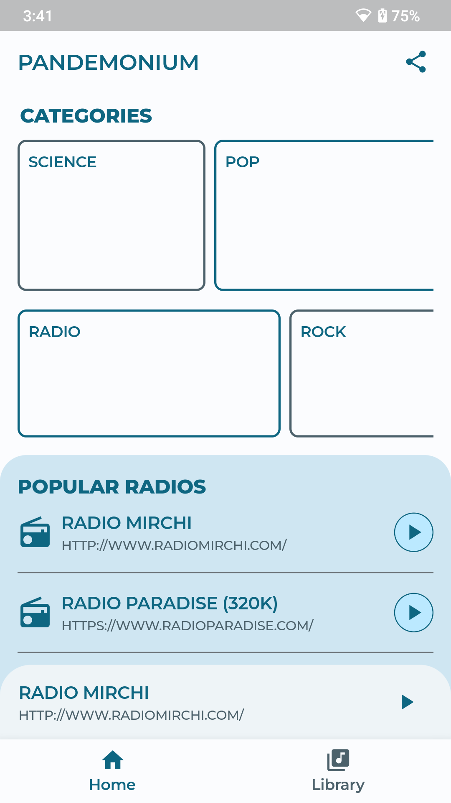
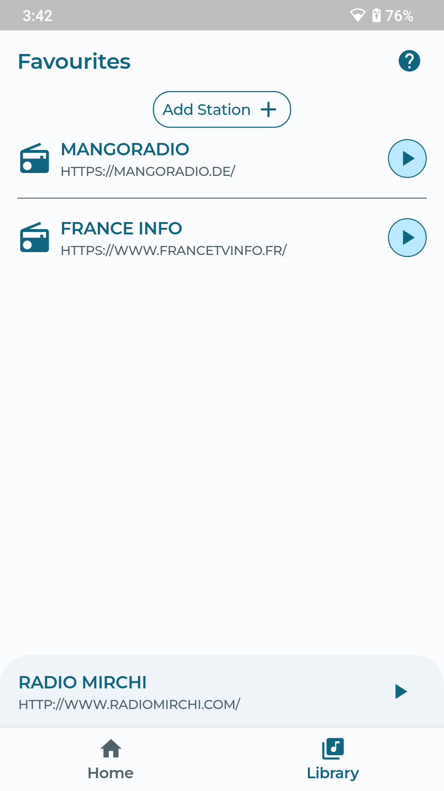
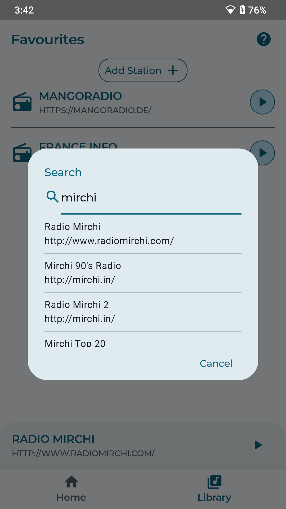

<h1 align="center"><b>Pandemonium</b></h1>

Explore the world of music and podcasts with a touch of magic and mystery.

    
    
    
     

---

    
    
    

### TODO
- [x] Add player.
- [x] Fix material 13 theme.
- [x] Add toasts / snackBars.
  - [ ] ~~move keyboard above everything.~~
- [x] Retry button on API error.
- [x] Searching and storing stable servers.
- [x] Notification playback
  - [x] try just audio
- [ ] Categories page.
  - [ ] ~~Fetch categories dynamically.~~
- [ ] Move to audio_service instead of just_audio_background.
- [ ] Add icon.
- [ ] Release on f droid.
- [ ] Release on play store.
